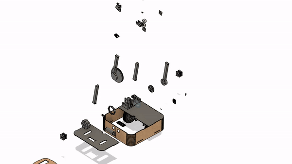
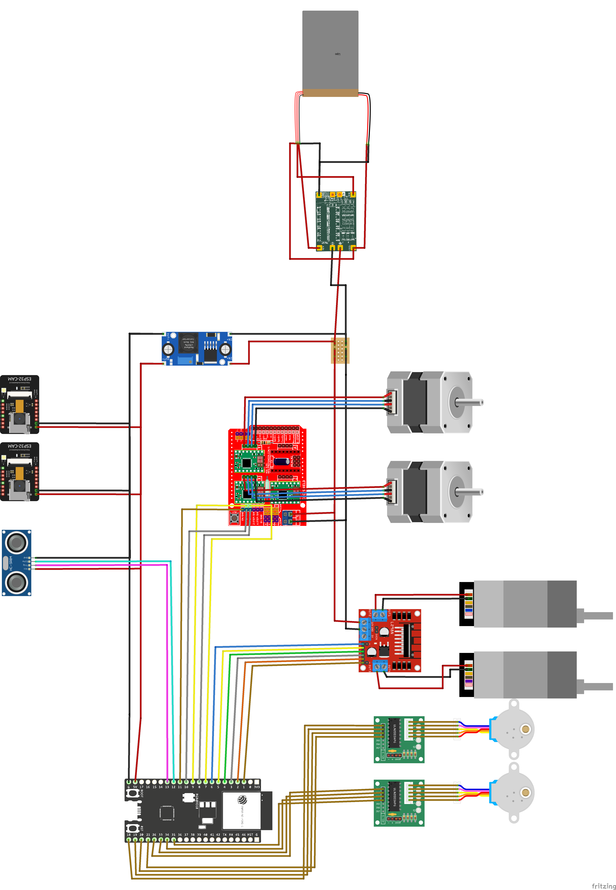

# Superscanner8000

- **photo of finished SuperScanner8000**
## Authors
   - [Noa Emien Ette](https://github.com/Noaemien)
   - [Kevan Lam Hopyang](https://github.com/KevanLam)
   - [Louis Léonard Marie Larcher](https://github.com/loulou413)
   - [Antoine Baptiste Gauthier](https://github.com/gautierantoine195)
   - [Mateo Tiedra](https://github.com/mateotiedra)
   - [Ugo Novello](https://github.com/Laggrif)
      
## Project Description 

The core of this project idea is to make a mobile robot capable of identifying the object of interest and taking pictures of it from all (possible) angles. This would be paired with a desktop application that would receive the images and apply the user-selected 3D reconstruction algorithm.

From this description, we can identify several key components the project needs:

1. **The Robot**:
   - 1.1: Navigate and plan routes around the object.
   - 1.2: Segment view and recognize the object of interest.
   - 1.3: Translate camera on the Z-axis whilst tracking the object of interest.

2. **The Desktop Application**:
   - 2.1: User can choose the object of interest.
   - 2.2: Process images sent by the robot using 3D reconstruction algorithms (NeRF, 2DGS, Multi-view stereo).

Nowadays, one does not need specialized high-end equipment to 3D scan objects. Most of us already have the necessary equipment—a smartphone, as long as it has a functioning camera and adequate software. For this project, we will not be using a smartphone, as having an integrated camera gives the robot higher usefulness without drastically increasing complexity.

In order to move the camera, we will use an arm with two segments, each powered by a stepper motor (like the Pixar lamp), fixed on top of the robot and oriented perpendicular to the wheels. In addition, the camera will be fixed to the arm using two servos offering roll and pitch control.

Most currently existing 3D object scanners are catered to small objects, rotating the object and photographing it from a fixed camera. We decided to take a different approach with the goal of providing more flexibility while keeping the complexity as low as possible.

## Project Structure

Below is a brief explanation of this repository's structure to provide context and aid readers' comprehension in the following sections of this document.
- `code` directory: contains all the code for the different parts of the project.
    - `hardware`: directory: contains all the code related to the hardware (motor movement, camera setup, connection to webserver) 
    - `software`: directory: contains all the code related to the software (webapp, navigation, reconstruction of 3d model...)
- `design` directory: contains all the 3D modeling files and exports along with the laser cut sheets.
- `diagrams` directory: contains all diagrams relate to the project
- `documentation` directory: contains all the pictures and schematics to be able to reproduce this project.
- `proposal` directory: the original document used to write the initial project proposal.

## Make your own SuperScanner8000

This section is dedicated to explaining how to build this project yourself! (All the printing/cutting part are available)

### Prerequisites
Comprehensive list of elements we used in our project along with needed equipment. To construct the device, one should

Buy:

- 2 Esp-32 Cam + ov5640 (for the camera on top => better image resolution, if you got a better camera, use it)
- Lot of PETG
- 2 NEMA-17 (stepper motor) (17HS4401 + A4988)
- 2 Chihai CHF-GM37-550ABHL (brush motor) + L298N (driver)
- 2 28BYJ-48 StepperMotor (stepper motor) + ULN2003 (driver)
- QAPass 1602a

Have access to:

- LIPO Batterie
- LIPO box (you can make it your own : [LIPO Protection tuto](https://github.com/epfl-cs358/cs358-resources/tree/main/cad/lipo_protection))
- Batterie management system (3S 12V 40A Lithium Batterie BMS)
- 3D printer with TPU filament (for the outer wheel)
- 3D printer with PET filament (bunch of it, pla should make it right too)
- Laser cutting machine
- MDF board 4mm
- Airsoft Bullets (gearbox)
- 6 small ball bearings (gearbox)
- 4 small omni bearings (caster wheel)
- Ball (caster wheel : e.g. table football ball)
- 4 Magnets (QAPass)
- Belt (Arm)
- 6mm Stailness Steel bar (Arm)
- 3 mm and 2.5 mm Screws
- Driller
- Bunch of different screwdrivers
- Soldering kit

### Hardware Assembly

##### Main Body

###### Base

Laser cut the following MDF (4mm) files :
   - [Bottom Base](design/dxf/bottom_base.dxf)
   - [Side Base](design/dxf/side_full.dxf)
   - [Top Base Front](design/dxf/top_base_front.dxf)
   - [Top Base Back](design/dxf/top_base_back.dxf)
   - 3*[Top Base Back](design/dxf/calibrate1)
   - 3*[Top Base Back](design/dxf/calibrate2)

The side is made to be foldable to give our SuperScanner8000 round corners. Be careful with these specific parts as they could break. 
You can assemble the bottom and side by glueing them but we recommend glueing the top parts once you have all the electronics setup inside.

###### Wheels

3D print the following parts : 
   - 2 * [Inner Wheel](design/prints/inner_wheel.stl)
   - 2 * [Outer Wheel](design/prints/outer_wheel.stl) (Beware you need to print this in TPU)

###### Caster Wheel

3D print the following folder : 
   - [Caster Wheel Folder](design/prints/caster)

You will also need the 4 omni bearings for this part.

###### Structures for electronics

3D print the following parts :
   - [CNC Shield Support](design/prints/CNC_shield_support.stl)
   - [ESP32-S2 Support](design/prints/ESP32-S2_support.stl)
   - [LiPo Support](design/prints/LiPo_support.stl)
   - [Chihai Support](design/prints/chihai_supports.stl)
   - [LiPo Bottom](design/prints/lipo_box/Lipo_bottom.stl)
   - [LiPo Box](design/prints/lipo_box/Lipo_box.stl)

Here, drill your own hole to make your own wire management.

##### Arm

###### Arm

3D print the parts in this folder :
   - [Arm Folder](design/prints/long_arm)

You should print 2 times esp_case2 for the cam in the box that we use for object detection.

###### Gearbox

3D print the parts in the actuator folder :
   - [15th Planet Carrier](design/prints/actuators/15th_planet_carrier.stl)
   - [15th Sun](design/prints/actuators/15th_sun_stage1.stl)
   - 3 * [25th Planet Stage 1](design/prints/actuators/25th_planet_stage1.stl)
   - 3 * [25th Planet Stage 2](design/prints/actuators/25th_planet_stage2.stl)
   - [Motor Base Ring](design/prints/actuators/Nema17_base_ring.stl)
   - [Motor Clamp](design/prints/actuators/Nema17_clamp.stl)
   - [Motor Mount](design/prints/actuators/nema17_mount.stl)

You'll also need the 6 ball bearings and the airsoft bullets to create this gearbox.
We followed [this tutorial](https://www.thingiverse.com/thing:4428749/) to create our gearbox.

###### Motor Housings

3D print the following parts :
   - [Nema17 Housings](design/prints/housing_on_base.stl)

Here we also used some small carpet textile to reduce the stepper motor noise.

###### Assembly Of The Arm

Once you have printed all these components you will firstly you'll want to screw the 4 arm parts together as well as the upper arm (make sure you add the metal/stainless steel bar at the elbow and the camera in the upper arm section). You can also screw the housings to the top of the base and screw the gearbox to a stepper motor in parallel. Now you can screw the arm to the gearbox and finally place the stepper motors in the housings (first thebelt one and then the gearbox one, don't forget the carpet). Add the belt and you'll be good to go!

### Electronic
#### Diagram

### Software
The structure of the software as well as an installation guide can be found in the [software directory](code/software).
## Gratitude and Appreciation
We would like to express our special thanks to our assisstant [Pinar](https://github.com/pinar-oray) and [Julian](https://github.com/julianmarmier), whose insights and suggestions were instrumental in shaping our super scanner. We are also grateful to [Timofey](https://github.com/kreslotim) for his technical support and encouragement and constructive feedback.

And I (Kevan) would like to thanks my peers, my friends for this fun project.

